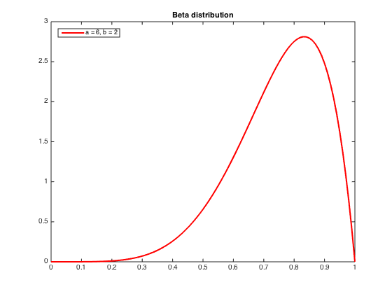

# crowdsourcing
Crowdsourcing project for IE598 Graphical Models 

The project description is given on [the course page](http://web.engr.illinois.edu/~swoh/courses/IE598/hw/project2015.pdf). 

The main file in this project is [crowdsourcing.m](crowdsourcing.m). The idea is that this file is the 
overall runner, and the other files are modules that can be swapped in and out.

For reference, the following diagram shows the prior for the 
